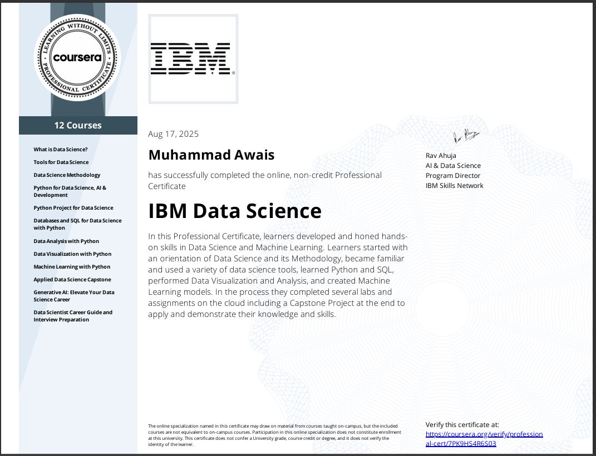
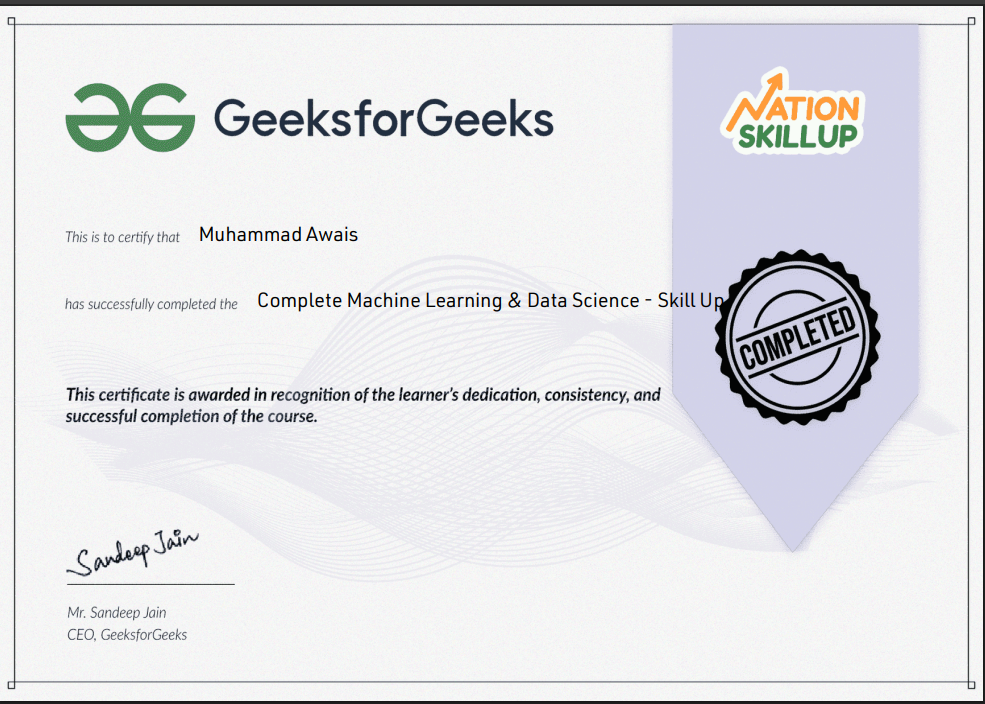
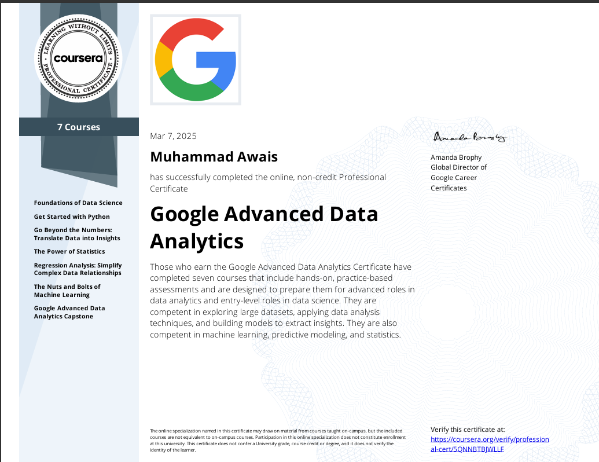

<h1 align="center">Hi 👋, I'm Muhammad Awais</h1>
<h3 align="center">
Results-driven Data Scientist and AI Practitioner specialized in Machine Learning, Deep Learning, and Data Analytics.  
Focused on building intelligent, scalable, and real-world data solutions 🚀
</h3>

  

---

### 🧑‍💻 About Me
- 🎓 **IBM Certified Data Scientist** from Pakistan.
- 🤖 Skilled in **Python, ML, DL, NLP, and LLM-based applications**.
- 📊 Strong in **EDA**, **Data Visualization**, and **Model Building**.
- 📌 **FYP**: AI-Based Book Recommendation System using LangChain.
- 🎯 2025 Goal → **Build real-world AI solutions & start freelancing**.
- 💬 Ask me about — `Python`, `Pandas`, `EDA`, `ML Projects`, `LangChain`.

---

### 🧰 Tech Stack

  
  
  
  
  
  
  
  
  
  

---

### 📊 GitHub Stats

  

---

### 🚀 Featured Projects

| Project | Description | Link |
|--------|-------------|------|
| 📚 AI Book Recommender | LangChain + Vector DB | 🔗 [Repo](https://github.com/Muhammad-Awaix/FYP) |
| 🎬 Movie Recommender | Content-Based Filtering | 🔗 [Project](https://github.com/Muhammad-Awaix/-ML-Pyhton-Projects/blob/main/Movies_Rec_Sys.ipynb) |
| 📉 Stock Price Prediction | LSTM Deep Learning | 🔗 [Notebook](https://github.com/Muhammad-Awaix/-ML-Pyhton-Projects/blob/main/Stock_price.ipynb) |
| 🧩 Customer Segmentation | K-Means clustering | 🔗 [Notebook](https://github.com/Muhammad-Awaix/Data-Science-Learning/blob/main/Python/Unsupervised_Learning/k_means_project.ipynb) |

---

### 📚 Learning Resources
📌 Explore my full ML & Python practice repository:  
🔗 https://github.com/Muhammad-Awaix/Data-Science-Learning/tree/main/Python

---

### 📃 Top Certifications

  
  
  
  

---

### 📫 Connect With Me

  
  
  

---

### ⚡ Quote
> “First, solve the problem. Then, write the code.” — John Johnson
